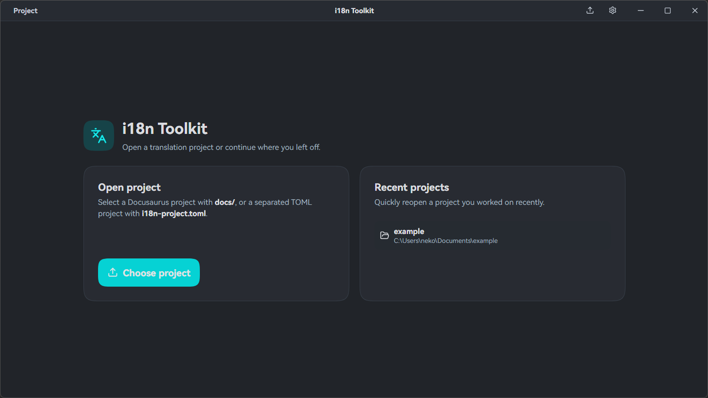
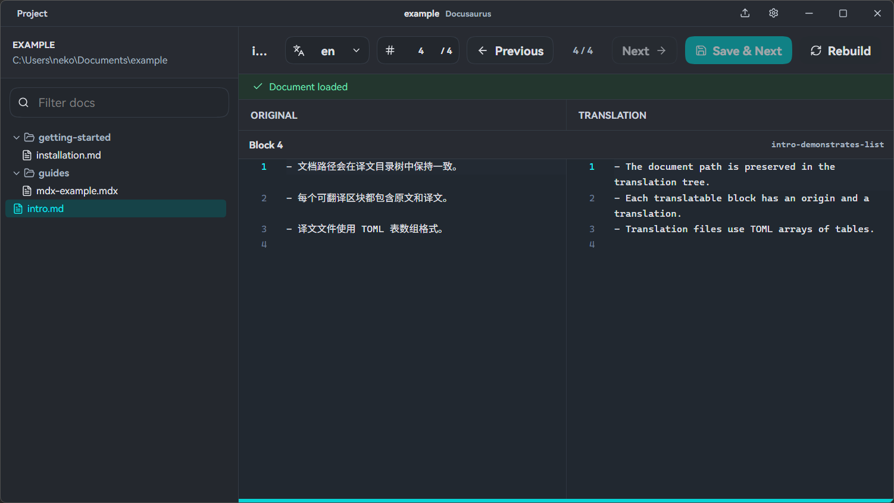

# i18n toolkit GUI

## what is this project?

This project is a electron GUI for i18n workflow.

## UI




## Dev

Install Dependency

```shell
yarn install
```

```shell
yarn dev
```

## Build

Install Dependency

```shell
yarn install
```

### Windows

build to dir

```shell
yarn release:win:dir
```

build to zip

```shell
yarn release:win:zip
```
